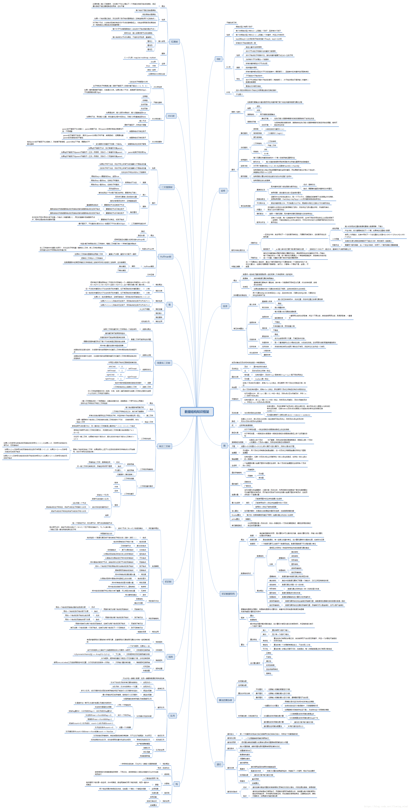
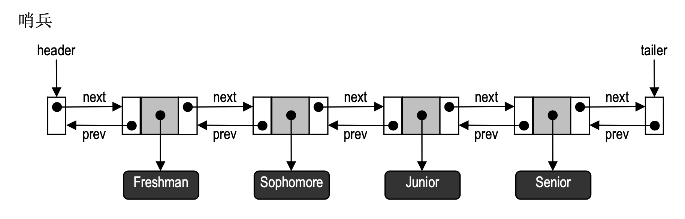
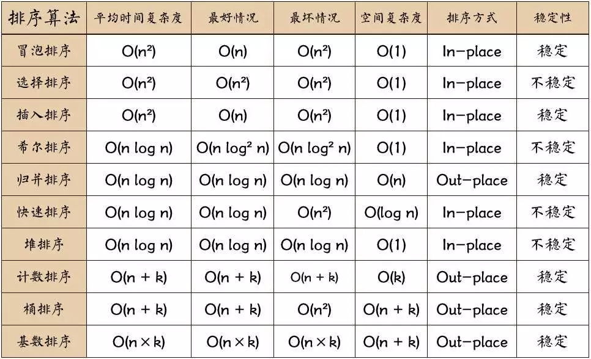

# algorithm



## 数据结构

1. 队列和栈
栈和队列基于数组实现，数组是一种连续存储线性结构，长度无法改变
优缺点：存取速度快，插入删除元素很慢,栈的操作只限于栈顶元素

2. 链表

链表是离散存储线性结构，n个节点离散分配，彼此通过指针相连，每个节点只有一个前驱节点，每个节点只有一个后续节点，首节点没有前驱节点，尾节点没有后续节点。
优缺点：空间没有限制，插入删除元素很快，存取速度很慢

单向链表：一个节点指向下一个节点
双向链表：一个节点有两个指针域
循环链表：能通过任何一个节点找到其他所有的节点，将两种(双向/单向)链表的最后一个结点指向第一个结点从而实现循环

3. 双向链表

- 基于双向链表实现的双端队列
  

```
最前端和最后 端各设置一个哑元节点(Dummy node )。这两个节点分别称作头节点(Header node )和尾节点 (Trailer node)(一)，起哨兵(Sentinel)的作用。
1、首、末节点的插入
2、首、末节点的删除
3、一般节点的插入与删除
```


## 概念

1、稳定排序：如果 a 原本在 b 的前面，且 a == b，排序之后 a 仍然在 b 的前面，则为稳定排序。

2、非稳定排序：如果 a 原本在 b 的前面，且 a == b，排序之后 a 可能不在 b 的前面，则为非稳定排序。

3、原地排序：原地排序就是指在排序过程中不申请多余的存储空间，只利用原来存储待排数据的存储空间进行比较和交换的数据排序。

4、非原地排序：需要利用额外的数组来辅助排序。

5、时间复杂度：一个算法执行所消耗的时间。

6、空间复杂度：运行完一个算法所需的内存大小。


## 排序算法



- 选择排序
```
1、找到数组中最小的那个元素，其次，将它和数组的第一个元素交换位置
2、剩下的元素中找到最小的元素，将它与数组的第二个元素交换位置，如此往复
```
- 插入排序
```
1、从数组第2个元素开始抽取元素，把它与左边第一个元素比较，如果左边第一个元素比它大，则继续与左边第二个元素比较下去，直到遇到不比它大的元素，然后插到这个元素的右边
2、继续选取第3，4，….n个元素,重复步骤 2 ，选择适当的位置插入
```

- 冒泡排序
  
普通版本
```
1、把第一个元素与第二个元素比较，如果第一个比第二个大，则交换他们的位置。接着继续比较第二个与第三个元素，如果第二个比第三个大，则交换他们的位置。一轮下来排在最右的元素就会是最大的数
2、除去最右的元素，我们对剩余的元素做同样的工作，如此重复下去，直到排序完成
```
优化版本
```
1、假如从开始的第一对到结尾的最后一对，相邻的元素之间都没有发生交换的操作、此时的数组已经是有序的了，我们无需再对剩余的元素重复比较下去了。
```

- 希尔排序
```
先让数组中任意间隔为 h 的元素有序，刚开始 h 的大小可以是 h = n / 2,接着让 h = n / 4，让 h 一直缩小，当 h = 1 时，也就是此时数组中任意间隔为1的元素有序，此时的数组就是有序的了。
```

- 归并排序

递归方式
```
把大的数组分成两个，然后对这两个数组分别进行排序，之后在把这两个数组合并成一个有序的数组。由于两个小的数组都是有序的，所以在合并的时候是很快的。
```
非递归式
```

```

- 快速排序
```
1、我们从数组中选择一个元素，我们把这个元素称之为中轴元素，然后把数组中所有小于中轴元素的元素放在其左边，所有大于或等于中轴元素的元素放在其右边
2、从中轴元素那里开始把大的数组切割成两个小的数组
3、让中轴元素左边的数组和右边的数组也重复同样的操作，直到数组的大小为1，此时每个元素都处于有序的位置
```
- 堆排序
```
1、堆顶的元素与最后一个元素交换，交换之后破坏了堆的特性，我们再把堆中剩余的元素再次构成一个大顶堆
```

- 计数排序
```
1、把数组元素作为数组的下标，然后用一个临时数组统计该元素出现的次数，例如 temp[i] = m, 表示元素 i 一共出现了 m 次。最后再把临时数组统计的数据从小到大汇总起来，此时汇总起来是数据是有序的
```

- 桶排序
```
把最大值和最小值之间的数进行瓜分，例如分成  10 个区间，10个区间对应10个桶，我们把各元素放到对应区间的桶中去，再对每个桶中的数进行排序，可以采用归并排序，也可以采用快速排序之类的
```

- 基数排序
```
基数排序的排序思路是这样的：先以个位数的大小来对数据进行排序，接着以十位数的大小来多数进行排序，接着以百位数的大小……

排到最后，就是一组有序的元素了。不过，他在以某位数进行排序的时候，是用“桶”来排序的。
```