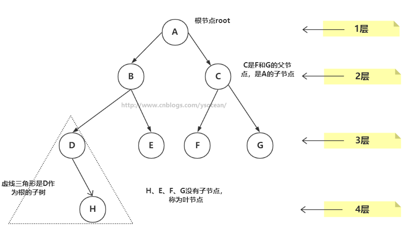

# 树优点

数组的数据结构：有序数组，查找很快，并介绍可以通过二分法查找，但是想要在有序数组中插入一个数据项，就必须先找到插入数据项的位置，然后将所有插入位置后面的数据项全部向后移动一位，来给新数据腾出空间，平均来讲要移动N/2次，这是很费时的。同理，删除数据也是

链表的数据结构：链表的插入和删除很快，我们只需要改变一些引用值就行了，但是查找数据却很慢了，因为不管我们查找什么数据，都需要从链表的第一个数据项开始，遍历到找到所需数据项为止，这个查找也是平均需要比较N/2次

树的数据结构：同时具备数组查找快的优点以及链表插入和删除快的优点

树种类：多路树、二叉树

①、路径：顺着节点的边从一个节点走到另一个节点，所经过的节点的顺序排列就称为“路径”。

②、根：树顶端的节点称为根。一棵树只有一个根，如果要把一个节点和边的集合称为树，那么从根到其他任何一个节点都必须有且只有一条路径。A是根节点。

③、父节点：若一个节点含有子节点，则这个节点称为其子节点的父节点；B是D的父节点。

④、子节点：一个节点含有的子树的根节点称为该节点的子节点；D是B的子节点。

⑤、兄弟节点：具有相同父节点的节点互称为兄弟节点；比如上图的D和E就互称为兄弟节点。

⑥、叶节点：没有子节点的节点称为叶节点，也叫叶子节点，比如上图的H、E、F、G都是叶子节点。

⑦、子树：每个节点都可以作为子树的根，它和它所有的子节点、子节点的子节点等都包含在子树中。

⑧、节点的层次：从根开始定义，根为第一层，根的子节点为第二层，以此类推。

⑨、深度：对于任意节点n,n的深度为从根到n的唯一路径长，根的深度为0；

⑩、高度：对于任意节点n,n的高度为从n到一片树叶的最长路径长，所有树叶的高度为0

# 基本操作

- 查找节点：从根节点开始遍历
- 插入节点：找到插入的位置。与查找操作相似，由于二叉搜索树的特殊性，待插入的节点也需要从根节点开始进行比较，小于根节点则与根节点左子树比较，反之则与右子树比较，直到左子树为空或右子树为空，则插入到相应为空的位置，在比较的过程中要注意保存父节点的信息 及 待插入的位置是父节点的左子树还是右子树，才能插入到正确的位置。
- 二叉树遍历：
  - 1、中序遍历:左子树——》根节点——》右子树；
  - 2、前序遍历:根节点——》左子树——》右子树；
  - 3、后序遍历:左子树——》右子树——》根节点
- 删除节点：
  - 1、该节点是叶节点（没有子节点）：要删除叶节点，只需要改变该节点的父节点引用该节点的值，即将其引用改为 null 即可。要删除的节点依然存在，但是它已经不是树的一部分了，由于Java语言的垃圾回收机制，我们不需要非得把节点本身删掉，一旦Java意识到程序不在与该节点有关联，就会自动把它清理出存储器
  - 2、该节点有一个子节点：删除有一个子节点的节点，我们只需要将其父节点原本指向该节点的引用，改为指向该节点的子节点即可
  - 3、该节点有两个子节点：找比删除节点关键值大的节点集合中最小的一个节点，只有这样代替删除节点后才能满足二叉搜索树的特性。
    - 后继节点是删除节点的右子节点
    - 后继节点是删除节点的右子节点的左子节点
  - 备注：删除其实是挺复杂的，那么其实我们可以不用真正的删除该节点，只需要在Node类中增加一个标识字段isDelete，当该字段为true时，表示该节点已经删除，反正没有删除。那么我们在做比如find()等操作的时候，要先判断isDelete字段是否为true。这样删除的节点并不会改变树的结构。

哈夫曼编码:二叉树中有一种特别的树——哈夫曼树（最优二叉树），其通过某种规则（权值）来构造出一哈夫曼二叉树，在这个二叉树中，只有叶子节点才是有效的数据节点（很重要），其他的非叶子节点是为了构造出哈夫曼而引入的！
哈夫曼编码是一个通过哈夫曼树进行的一种编码，一般情况下，以字符：‘0’与‘1’表示。编码的实现过程很简单，只要实现哈夫曼树，通过遍历哈夫曼树，规定向左子树遍历一个节点编码为“0”，向右遍历一个节点编码为“1”，结束条件就是遍历到叶子节点！因为上面说过：哈夫曼树叶子节点才是有效数据节点！

哈夫曼解码:如果收到上面的一串哈夫曼编码，怎么解码呢？消息中出现的字符在哈夫曼树中是叶节点，也就是没有子节点，如下图：它们在消息中出现的频率越高，在树中的位置就越高，每个圆圈外面的数字就是频率，非叶节点外面的数字是它子节点数字的和。每个字符都从根开始，如果遇到0，就向左走到下一个节点，如果遇到1，就向右。比如字符A是010，那么先向左，再向右，再向左，就找到了A，其它的依次类推

## 红黑树

红-黑规则
- 1.每个节点不是红色就是黑色的；
- 2.根节点总是黑色的；
- 3.如果节点是红色的，则它的子节点必须是黑色的（反之不一定）,(也就是从每个叶子到根的所有路- 径上不能有两个连续的红色节点)；
- 4.从根节点到叶节点或空子节点的每条路径，必须包含相同数目的黑色节点（即相同的黑色高度

红-黑树主要通过三种方式对平衡进行修正，改变节点颜色、左旋和右旋